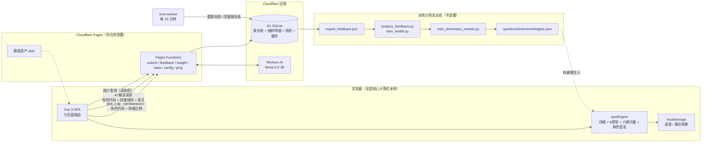

# 系统架构

本文给出 ACGTI 的全局视图：数据流、模块分层与扩展方式。接口细节见 [`backend.md`](./backend.md)，关键决策的来龙去脉见 [`adr/`](./adr/)。

## 总览

## 分层职责

| 层 | 位置 | 职责 | 明确不做 |
|:--|:--|:--|:--|
| 表现层 | `src/pages/`、`src/components/` | 页面结构、交互、可访问性 | 不做计分与数据变换 |
| 组合层 | `src/composables/` | 页面状态编排（答题进度、分享、SEO） | 不做纯函数逻辑 |
| 内核层 | `src/utils/quizEngine.ts` | MBTI 计分、原型匹配、角色排序（纯函数，有单测） | 不读网络、不碰 DOM |
| 数据层 | `src/content/` → `src/data/` | 角色源文件 → 构建期聚合产物 | 引擎不直接读 content 源文件 |
| 边缘层 | `functions/api/` | 输入白名单校验、限流、SQL、AI 编排 | 不做业务规则（都在前端引擎） |
| 离线层 | `analysis/`、`cron-worker/` | 校准流水线与定时快照 | 不在请求路径上 |

设计主线只有一条：**内容是数据，规则在引擎，边缘只做搬运**。新增内容的成本是一次 JSON 编辑 + 一次构建；新增规则的门槛是一组单元测试。

## 数据流三主干

1. **答题主干（零网络）**：浏览器拉取静态题库 → 本地计分 → 结果与进度写 localStorage → 结果页渲染。断网状态下除了统计与 AI 卡片，体验完整。
2. **统计主干（单向脱敏）**：结果确定后 fire-and-forget 上报聚合自增；cron 每 15 分钟把聚合表重算为快照；统计端点只读快照。逐题答案只有 2% 抽样与主动反馈两条路径进入 D1。
3. **校准主干（回流）**：本地导出 D1 反馈数据 → 一致率/混淆矩阵/题目健康度报表 → 逻辑回归产出逐题维度权重 → 作为 `questionDimensionWeights.json` 回到构建期。数据的终点是改进题目本身，这是项目区别于「一次性玩具」的核心闭环。

## 扩展指南

### 新增角色

在 `src/content/characters/` 新建 JSON（meta + visual + i18n 四语），放入图片到约定目录，`npm run build` 完成聚合与校验。详见 [`新增角色流程.md`](./新增角色流程.md)。

### 新增后端端点

`functions/api/<name>.ts` 导出 `onRequestGet/Post`；复用 `_shared.ts` 的白名单校验与限流；涉及新表时新增迁移文件（不可回改已有迁移，见 [ADR-0005](./adr/0005-migrations-immutable.md)）；在 `public/api/openapi.yaml` 与 `docs/api.md` 补文档。

### 新增测评框架（Big Five / 九型，规划中）

现有内核已把「维度定义」数据化（题目的 dimension/sign、覆盖表权重），但四对维度的字母表与 MBTI 汇总仍内嵌在 `quizEngine.ts`。扩展路径应当是：

1. 抽象 `AssessmentFramework` 描述（维度列表、字母表、结果合成规则）为一份 JSON；
2. 引擎按框架描述参数化（当前实现等价于 `mbti.json` 的特例）；
3. 题库与角色库标记所属框架，路由按框架选择题库。

在动手前请先写一篇 ADR 论证（参考 [ADR-0003](./adr/0003-data-driven-engine.md) 的演进方向一节）。

### 升级 AI 模型

`functions/api/insight.ts` 顶部的 `MODEL_ID` 常量 + 清空 `ai_insight_cache`（缓存行有 model 字段，可按需保留旧模型的存量文案）。提示词约束见 [ADR-0006](./adr/0006-ai-insight-workers-ai.md)。
